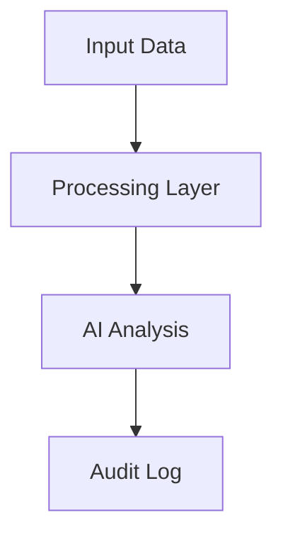

## Executive Summary

* **Context**: {Brief problem statement}
* **Action**: {Core technical solution implemented}
* **Result**: {Quantifiable outcome/ROI}

## The Challenge: {Problem Context}

{Describe the technical or business friction. Use data/charts if available.}

## Technical Architecture

{explain the high-level design}



## Implementation Details

### Stack Choice

* **Backend**: {Tech} - {Why chosen}
* **AI Model**: {Model} - {Why chosen}

### Code Highlight

{Provide a snippet of the most interesting/critical code logic}

```python
# Implementation of core logic
def perform_audit(data):
    # logic
    return result
```

## Critical Analysis

### What Went Well

* {Success 1}
* {Success 2}

### Challenges & Bottlenecks

* {Challenge 1}: {How it was solved}

## Future Roadmap

{What comes next? Scaling? New features?}
