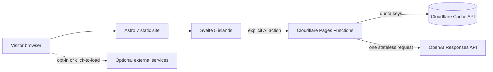
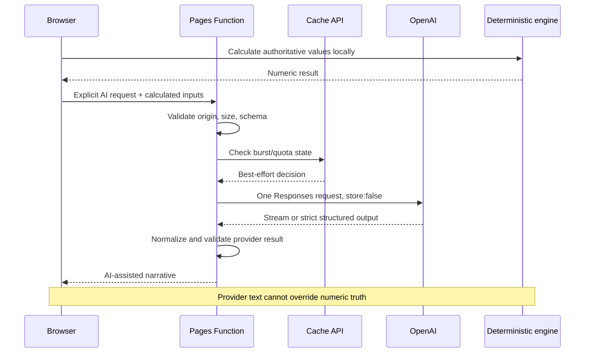

# Architecture

This is the living technical overview of me-mateescu.de. It describes the repository canonical
state. Deployed production may lag this state until an authorized release completes. Narrow
contracts and runbooks remain in [docs/operations](operations/).

## System context

The product combines a statically rendered multilingual portfolio with interactive browser tools
and a small set of Cloudflare Pages Functions. Most routes need no server execution. Financial
engines run deterministically in the browser; AI-assisted narrative crosses a server-side provider
boundary only after an explicit user action.

## Static Astro layer

Astro 7.1.3 builds static HTML, localized routes, MDX content, sitemap output, and a Pagefind search
index. `astro.config.mjs` is authoritative for integrations, Markdown processing, sitemap rules, and
static output; it pins the Unified Markdown processor (`@astrojs/markdown-remark`'s `unified()`)
rather than Astro 7's default Sätteri processor, enforced by a permanent test. Tailwind CSS v4
supplies design tokens and utilities. The build output is `dist/`; it is generated and not a
documentation source of truth.

Primary static responsibilities:

- DE, EN, and RO portfolio and service routes;
- project, experience, education, certification, and service content from `src/data/`;
- blog and resource content from `src/content/`;
- metadata, hreflang, sitemap, and structured data;
- privacy, imprint, tool entry points, and disabled-state messaging;
- Pagefind client-side search.

## Svelte islands

Svelte 5 components add interaction to otherwise static routes. Tool islands own local form state,
charts, exports, disclosure controls, and deterministic calculation calls. Hydration is scoped per
component rather than turning the site into a client-only application.

The principal islands cover:

- startup runway and burn rate;
- Brutto-Netto/PAP;
- XRechnung generation;
- cashflow forecasting;
- investment analytics;
- Founder Compass.

No current authentication or client portal exists. Browser state is limited to feature-specific
preferences and local tool state; there is no user account database.

## Cloudflare Pages and Pages Functions

Cloudflare Pages serves static assets. `functions/api/` contains six Pages Functions:

| Route | Responsibility | External provider |
| --- | --- | --- |
| `/api/chat` | Portfolio chat and JD analysis | OpenAI |
| `/api/compass` | Founder Compass report stream | OpenAI |
| `/api/cashflow-scenario` | Structured stress narrative | OpenAI |
| `/api/investment-analysis` | Structured investment narrative | OpenAI |
| `/api/sample-review` | Form-to-email adapter | Resend, inactive |
| `/api/health` | Minimal runtime and release identity | None |

`functions/_lib/http.ts` and `functions/_lib/contracts.ts` normalize method and origin checks,
content limits, timeouts, success envelopes, and error envelopes. The operational context owns the
server-generated request ID and one terminal event. The exact transport contract is documented in
[pages-functions-contracts.md](operations/pages-functions-contracts.md).

## Normalized request and response contracts

Function inputs are untrusted. Each route applies its relevant method, origin, media-type, body-size,
and schema validation before provider work. Server code controls provider settings; browsers cannot
select a model or token ceiling.

Successful JSON responses use a stable data envelope and request ID. Failures use normalized error
codes and retryability metadata. Streaming routes translate provider events into the product's own
SSE events; raw provider event names, reasoning content, and response identifiers are not exposed.

## OpenAI Responses provider boundary

`functions/_lib/responses.ts` owns the single `/v1/responses` URL, authorization header, timeout
integration, output extraction, strict structured-output parsing, SSE decoding, and unconditional
`store: false`. It does not choose endpoint models or prompts.

The production mapping is:

| Function | Model | Reasoning | Response mode |
| --- | --- | --- | --- |
| `chat.ts` | `gpt-5.6-terra` | low | SSE stream |
| `compass.ts` | `gpt-5.6-sol` | high | SSE stream |
| `cashflow-scenario.ts` | `gpt-5.6-terra` | medium | strict structured output |
| `investment-analysis.ts` | `gpt-5.6-sol` | medium | strict structured output |

Each accepted action makes at most one provider request. There is no automatic retry, fallback
model, provider substitution, tool invocation, conversation object, or persisted response-chain
identifier. `store: false` disables provider application-state persistence for the response object;
it is not a general data-retention guarantee.

Full settings, ceilings, failure behavior, and mocked validation live in
[ai-provider-responses-migration.md](operations/ai-provider-responses-migration.md).

## Representative AI request flow

## Streaming and Structured Outputs

Chat and Founder Compass use streaming. The shared incremental decoder tolerates fragmented UTF-8,
CRLF boundaries, comments, and unknown events; a truncated stream becomes a controlled error.

Cashflow and investment analysis use strict JSON Schema with complete required fields and no
additional properties. Refusal, incomplete generation, failed status, malformed JSON, or an invalid
top-level value becomes a controlled provider failure rather than guessed output.

## Deterministic financial engines

The authoritative calculation layer lives under:

- `src/lib/fin-core/` for money/date primitives, runway, payroll, validation, and XRechnung;
- `src/lib/cashflow/` for month-by-month projection and stress transforms;
- `src/lib/investment/` for return, risk, Monte Carlo, and German investment-tax calculations;
- `src/lib/founder-compass/` for deterministic profile scoring before generated interpretation.

Financial engines are deterministic and independently testable. BMF PAP artifacts, German
social-contribution thresholds, investment-tax constants, rounding, reconciliation, and known
limitations are recorded in
[financial-calculation-validation-2026.md](operations/financial-calculation-validation-2026.md).

The disclosed Vorabpauschale implementation uses a smoothed annual capital path. It does not model
historical year-by-year market and basis-rate volatility.

## RAG and corpus flow

`public/corpus.jsonl` is the curated portfolio knowledge corpus. Chat retrieves relevant evidence
locally/server-side and combines it with trusted instructions and the current user turn. The corpus
is evidence for portfolio facts, not authority for financial calculations or legal conclusions.
Corpus checks guard structure and content policy. No vector database or external retrieval service is
currently required.

## Privacy and consent architecture

`src/lib/consent.ts` owns a versioned preference record (v3) with two independent, opt-in-only
analytics channels: `performanceAnalytics.cloudflareRum` and `acquisitionAnalytics.ahrefs`. Necessary
preferences (theme, language) never imply either. Each channel is gated, loaded, and withdrawable
independently — accepting one does not grant the other, and a v2 record's single `analytics` boolean
migrates only to the Ahrefs channel, never to Cloudflare RUM. Giscus and YouTube (privacy-enhanced
`youtube-nocookie.com` domain) are click-to-load. AI processing occurs only after the visitor
requests it, sees contextual disclosure, and confirms an unchecked-by-default, per-surface consent
checkbox (`AI_PRIVACY_NOTICE_VERSION` in `functions/_lib/ai-privacy-notice.ts`); the checkbox state is
never persisted and each of the four AI Functions enforces the same pair server-side
(`400 PRIVACY_CONSENT_REQUIRED` otherwise). Founder Compass, Cashflow, and Investment check it
immediately after body parsing, before any rate-limit consumption, quota lookup/write, or provider
call. Chat is an accepted, documented exception: its pre-existing, body-independent per-IP burst
limiter and a read-only quota lookup (needed to render the quota badge for the consent-exempt
deterministic fact-chip path too) run before the consent check, but the quota *write* and the
provider call still run only after it — see
[operational-controls-observability.md](operations/operational-controls-observability.md) for the
exact ordering. Deterministic fact-chip chat answers and the Cashflow/Investment client-side
calculations remain fully usable without this consent — only the OpenAI-bound narrative/
interpretation layer is gated.

Cloudflare Web Analytics (RUM) is loaded by the application itself — a manually embedded, consent-gated
`<script>` in `BaseLayout.astro` — rather than relying on Cloudflare's platform-level automatic
injection, so it can be withheld until performance-analytics consent. Remotely, Cloudflare's
platform-level automatic injection has been disabled (Phase 3-C Step 2C-1: Pages Web Analytics
tag/token nulled, zone Automatic Setup switched to manual-install), and the application loader's site
token matches the current manual-install token. Phase 3-C Step 2C-2's canonical state was promoted to
production by the Phase 4 controlled production release, replacing the legacy baked-in beacon
described in
[cloudflare-pages-configuration.md](operations/cloudflare-pages-configuration.md); that document
remains the authority for the remote cutover record and any residual gap.

The technical service matrix and validation boundary live in
[privacy-consent-external-services.md](operations/privacy-consent-external-services.md). The owner
has recorded a technical/privacy review and an explicit risk-acceptance decision for this personal,
non-commercial scope; qualified external legal review of the specific open legal questions in that
document (the Cloudflare controller/processor role split and the Art. 6(1)(a)/Art. 22 legal-basis
wording) remains trigger-based, not completed, and is not a blocker for this release — technical
documentation does not replace that review, and this is not a claim of absolute legal compliance.

## External-service loading boundaries

- Cloudflare is part of baseline delivery; Cloudflare Web Analytics (RUM) is additionally not loaded
  without performance-analytics opt-in.
- Ahrefs Web Analytics is not loaded without acquisition-analytics opt-in.
- Giscus is not loaded before the visitor requests comments.
- YouTube/Spotify embeds are not loaded before the visitor requests the media placeholder.
- OpenAI receives data only after a user-requested AI action confirmed by the contextual consent
  checkbox described above.
- The `/projects` GitHub summary is a static, build-time snapshot (`src/data/github-snapshot.json`,
  refreshed only by an explicit, manual script run); the browser never contacts `api.github.com`.
- cal.eu is reached only when a visitor follows the booking link.
- Resend remains inactive; Sample Review fails closed before parsing form data when configuration is
  absent.

There is no current upload service, queue, malware-scanning pipeline, or attachment forwarding.

## Quota and abuse-control architecture

Functions combine input limits, origin checks, in-memory burst limits, and hashed-IP Cache API quota
entries. Chat allows four ordinary chat requests and one JD analysis per 24 hours. Founder Compass,
cashflow narrative, and investment narrative each use a seven-day server quota plus client-side
cooldown. Sample Review has a 60-second throttle but remains inactive.

Cache API state is local to Cloudflare execution geography and check/set operations have a narrow
race. These quotas are therefore abuse smoothing, not globally exact distributed accounting. Raw IP
addresses are not sent to OpenAI. The future HMAC-peppered safety identifier and distributed quota
store remain trigger-based work.

## XRechnung and PAP generation and validation

The XRechnung tool builds a canonical invoice model and exports the documented UBL 2.1 or CII scope.
Generator fixtures verify structure and calculation behavior. KoSIT is a separate offline validation
gate using pinned validator and configuration artifacts; standard support must not be conflated with
a blanket validator claim. See [CONFORMANCE.md](tools/xrechnung/CONFORMANCE.md) and
[kosit-offline-validation.md](operations/kosit-offline-validation.md).

The Brutto-Netto calculator uses a generated BMF PAP 2026 engine plus deterministic
social-contribution logic. Official artifacts and permanent fixtures are checksum guarded.

## Build and deployment topology

`npm run build` runs Astro and Pagefind locally. Cloudflare Pages is the deployment target.
Formal release evidence uses Node 22.22.3, npm 11.16.0, Linux x64/glibc. `wrangler.jsonc` codifies
compatible candidate settings, but configured dashboard state remains live until a separately
authorized activation and parity review.

The repository canonical state can be ahead of deployed production. A local green build does not
deploy, change remote configuration, or prove live provider access. Current release work must also
account for internal audit material in local integration history.

Tracked CI has one read-only quality workflow, one scheduled read-only security-audit workflow, and
one manual future release workflow. GitHub Actions is the intended future deploy owner. Deploy
remains fail-closed until remote variables confirm that ownership and confirm Cloudflare automatic
Git integration is disabled. The quality job builds and verifies once; the deploy job accepts only
the checksum-linked transferred artifact and never rebuilds. Neither workflow had been run or
activated remotely as of Phase 2C — this has since changed (see below). See
[release-pipeline.md](operations/release-pipeline.md).

Phase 3-B1 disabled Cloudflare's automatic production-deployment trigger for the `portfolio-astro`
Pages project (a live dashboard/API setting, not a `wrangler.jsonc` field) and confirmed, via two
real GitHub Actions runs against a public-safe preview commit, that the quality workflow's job emits
a check-run context that exactly satisfies the existing branch-protection required check. Phase 3-B3
and Phase 3-C Step 1B each subsequently built and published one reviewed public-safe release commit
on GitHub `master` for real (not a dry-run proof), using the documented commit-construction recipe
from [public-release-lineage-strategy.md](operations/public-release-lineage-strategy.md); GitHub
`master`'s quality/CodeQL checks have now run remotely, repeatedly, against real commits. The
`release.yml` deploy job's own fail-closed remote-ownership variables (`DEPLOYMENT_OWNER`,
`CLOUDFLARE_GIT_INTEGRATION_DISABLED`) remain unset; the manual release workflow itself has still not
been dispatched or activated remotely — every `master` update so far has reached GitHub through the
reviewed-commit-and-push method above, never through `release.yml`, and Cloudflare's own automatic
Git-integration production trigger remains disabled, so none of these `master` updates has deployed
to production.

## Release identity and provenance boundary

A clean source commit produces a version-1 identity with `schemaVersion`, `releaseId`, and
`sourceRevision`; the offline form also records `sourceTreeClean` and Git's `sourceCommitTime`.
`releaseId` is deterministic for those inputs. A generated, ignored constant links that identity to
the Pages Functions bundle because Pages build metadata is not an implicit runtime binding.

`/api/health` confirms only that the Function runtime responds and that its code identifies itself.
It uses the shared request context and completion boundary, supports `GET` and `HEAD`, returns normalized
`405` errors, sends `Cache-Control: no-store`, and makes no provider or storage request. It does not
prove provider health, configuration parity, product correctness, compliance, or deployment
approval.

The local provenance pipeline combines `dist/` with Wrangler's Pages Functions bundle as the
deployable artifact tree. A lexical, byte-based SHA-256 tree digest ignores mtimes and absolute paths
and rejects symlinks. The versioned manifest links that digest to the clean source revision,
exact release environment, tracked-source/package/lock/configuration checksums, and a normalized
CycloneDX 1.5 build dependency SBOM
generated from the complete lockfile, including development tooling. It is not a precise
deployed-runtime SBOM. The manifest and build dependency SBOM are offline evidence, not public
assets.

An eventual public release commit and this source revision are distinct lineage concepts. The
release commit must reproduce the approved tracked tree without exposing the raw internal integration
history. The exact local contracts and future lineage procedure live in
[release-identity-provenance.md](operations/release-identity-provenance.md) and
[public-release-lineage-strategy.md](operations/public-release-lineage-strategy.md).

The public lineage contract is machine checked and has a dry-run-only synthetic proof. A future
release commit has current public `master` as its sole parent, the approved canonical tracked tree,
and explicit canonical source/tree/artifact/manifest trailers. No real public release commit exists
yet.

The immutable Node image reproducibility gate compares a host-class build and two network-disabled
container builds. The authoritative `verify:release-candidate` command composes governance,
dependency, release, operational, CSP, domain, full KoSIT, local Wrangler/postdeploy, and Firefox
checks and writes ignored review summaries.

## Browser CSP boundary

Cloudflare Pages `_headers` delivers a restrictive `Content-Security-Policy-Report-Only` policy plus
same-origin modern and legacy reporting declarations. The policy is derived from actual generated
resources: self-hosted assets and Pagefind, consent-gated Cloudflare Web Analytics and Ahrefs, and
click-to-load Giscus/YouTube/Spotify. `api.github.com` is not permitted — the `/projects` GitHub
summary is a static build-time snapshot with no browser-side request. OpenAI and inactive Resend are
server-side and receive no browser allowance. External links alone add none.

`/api/csp-report` accepts only bounded legacy and Reporting API media types, returns an empty 204 for
accepted input, makes no external call, and reduces reports to closed directive/resource classes.
It never retains or logs report bodies, full URLs, referrers, samples, arbitrary hosts, IP/user-agent
data, or cookies. Inline script/style allowances remain documented static-Astro constraints. CSP is
not enforced in Phase 2C. See [csp-reporting.md](operations/csp-reporting.md).

## Operational control and observability boundary

Every active public Function creates one server-generated request context containing only a UUID,
closed route/method values, release ID, and monotonic start time. The UUID is shared with the
normalized public envelope; caller request-ID and Cloudflare headers are not trusted as identity.
One completion wrapper emits exactly one terminal request event, plus at most one provider terminal
event when a call began. Streaming requests finalize on completion, failure, or cancellation without
buffering the stream.

The sole runtime console boundary rebuilds events from a closed allowlist. It accepts no arbitrary
message, request/provider object, prompt/output, form or financial content, IP/hash, cookie/header,
provider response ID/error body, stack, path, host, or configuration value. A permanent AST guard
rejects direct console calls elsewhere in production Functions.

The shared failure taxonomy distinguishes validation, method/origin/media/body, quota, disabled,
invalid/missing configuration, provider timeout/rate-limit/refusal/malformed/unavailable, client
abort, and internal failure. These internal classes and provider/quota outcomes are not exposed in
public envelopes. The OpenAI transport records only approved model tier, validated aggregate usage,
provider duration, and truthful streaming first-output/completion state.

The CSP collector may additionally emit one bounded `csp.summary` per batch. Malformed telemetry is
attributed to fixed `telemetry.invalid` and `unknown` values, never to a real route and never with
the malformed value. Application quota rejection remains `QUOTA_REJECTED`/`NOT_CALLED`; a provider
429 remains `PROVIDER_RATE_LIMITED`/`RATE_LIMITED`.

Independent server-side controls default the four active AI surfaces on and inactive Sample Review
off. Narrow boolean parsing fails invalid values closed. Disabled/invalid requests exit before body,
quota mutation, or provider preparation. Controls are local contracts only; no remote values or
remote observability service were configured.

The full schema, quota semantics, candidate SLO measurement contract, and privacy threat review live
in [operational-controls-observability.md](operations/operational-controls-observability.md).

## Trust boundaries

| Boundary | Trusted | Untrusted or externally mutable | Enforcement |
| --- | --- | --- | --- |
| Browser to Function | Server constants and schemas | Request headers and body | Method, origin, size, schema, quota |
| Function to OpenAI | Request builder and output schema | Provider status and output | Timeout, one-call rule, SSE/schema validation |
| Function to local operational log | Closed context, enum metadata, release identity | Request/provider objects, content, errors, identifiers | Typed event contract, runtime allowlist, raw-console guard |
| Browser to CSP collector | Closed report/resource classes | Browser report body and URLs | Method/media/body/count/depth bounds, minimization, empty response |
| Browser calculations | Engine code and validated constants | User inputs | Type, range, finite-value, reconciliation checks |
| Content build | Repository content/config | Embedded HTML and external URLs | sanitization, lint, build guards |
| Optional service load | Consent state and loader | Third-party runtime | opt-in or click-to-load boundary |
| Release | Reviewed repository artifact and policy | Dashboard, workflow inputs, transferred artifact, deployed state | exact toolchain, public lineage, immutable pins, artifact reuse, explicit authorization and parity |

## Source-of-truth files

- `package.json`, `package-lock.json` — versions and commands.
- `astro.config.mjs`, `wrangler.jsonc` — build and candidate platform configuration.
- `src/pages/`, `src/components/`, `src/data/`, `src/content/` — public surfaces and content.
- `src/lib/fin-core/`, `src/lib/cashflow/`, `src/lib/investment/` — deterministic engines.
- `functions/api/`, `functions/_lib/` — server and provider boundaries.
- `config/release-policy.json`, `config/dependency-advisories.json` — machine release/advisory state.
- `.github/workflows/` — read-only quality and manual future release topology.
- `scripts/release/` — identity, artifact, lineage, reproducibility, postdeploy, rollback, browser,
  and unified-gate tooling.
- `tests/` — permanent behavioral and truth contracts.
- [AGENTS.md](../AGENTS.md) — repository governance.
- [ROADMAP.md](ROADMAP.md) — sequencing and deferred capabilities.

## Known architectural limitations

- Cache API quotas are not globally exact.
- The privacy-preserving provider safety identifier is deferred.
- Sample Review and Resend are inactive.
- Qualified external legal privacy review is trigger-based, not a release blocker, for the current
  non-commercial scope, per an explicit owner risk-acceptance decision (Phase 3-C Step 3E-A); the
  Cloudflare controller/processor role split and the Art. 6(1)(a)/Art. 22 legal-basis questions in
  [privacy-consent-external-services.md](operations/privacy-consent-external-services.md) remain
  genuinely open regardless of that decision.
- Live access to both configured OpenAI tiers is canary-confirmed (Phase 3-C Step 3C,
  `STEP3C-CANARIES-PASS`).
- Repository canonical state and deployed production state remain separate states as a matter of
  mechanism — a git commit and a live deployment are always two different systems. This separation is
  currently substantive: repository `master` has accumulated further post-release repository, security,
  governance, and control-plane work (Phase 5-D2-B and later) that has not been promoted as a new
  production release, so repository state and deployed production content have diverged again since
  the Phase 4 controlled production release.
- Vorabpauschale uses the disclosed smoothed annual path.
- Operational events remain local runtime console output; remote collection, retention, dashboards,
  alerts, and production SLO evidence do not exist.
- CSP enforcement remains a later evidence-based decision.
- Cloudflare account-level Logpush is confirmed not configured, and the Workers Observability API
  cannot retrieve the Pages-managed Functions script (Phase 3-C Step 3E-A, read-only) — a Pages
  Functions platform limitation, not a permission denial; accepted for this personal, low-volume,
  non-commercial release rather than a blocker. GitHub's repository security baseline (Dependabot
  alerts and automated security fixes, CodeQL default setup, `master` branch protection,
  `preview`/`production` Environments) is configured (Phase 3-B2). The Phase 5-D2A evidence baseline
  (2026-08-09) recorded CodeQL at 2 open `js/incomplete-url-substring-sanitization` alerts, root-caused
  as a scanner pattern match on a trusted-local-file documentation check rather than an untrusted-URL
  sanitization gap; Phase 5-D2-B closed both alerts through source-level remediation (`dismissed_at`
  null; not dismissed). Repository-wide open CodeQL alerts are 0 as of Phase 5-D2-B closure. Dependabot
  holds 0 open alerts, and a fresh `npm audit` plus a fresh exact-lockfile live GitHub Advisory Database
  scan (all three record types) found 0 unresolved applicable advisories — see
  [dependency-hygiene.md](operations/dependency-hygiene.md). A scheduled read-only security-audit
  workflow runs on GitHub Actions (Phase 3-B3). The Phase 3-C/Phase 4 routine-update freeze was lifted
  in repository-canonical `.github/dependabot.yml` once Phase 4 completed (Phase 5-D2-B), restoring
  `open-pull-requests-limit: 8` (npm) / `5` (github-actions) and resuming routine Dependabot
  version-update PR creation on the default branch; security alerts and automated security fixes were
  never subject to that freeze. Cloudflare production deployment ownership and current production
  state have been read-only verified: production continues to serve the Phase 4 release artifact,
  independently confirmed via both the Cloudflare API and a live `/api/health` fetch, and remains
  unchanged by Phase 5-D2-B's repository-only closure.
- There is no auth, client portal, queue, upload pipeline, or multi-provider abstraction.

## Trigger-based future architecture

Secure client intake, distributed quotas, versioned public APIs, portals, background processing, and
provider abstraction are intentionally absent. Their product and operational triggers, required
controls, and exit criteria live only in [docs/ROADMAP.md](ROADMAP.md).
