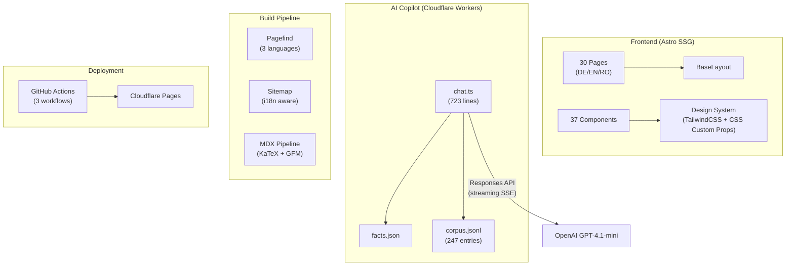

# 🔍 Portfolio Project — Comprehensive Audit

> **Site**: [me-mateescu.de](https://me-mateescu.de)
> **Date**: 2026-02-14
> **Codebase**: 22,791 lines across 68 source files
> **Branch**: `chore/local-setup` (30 commits ahead of `master`)
> **Framework**: Astro 5.x (static output) + Cloudflare Pages

---

## 1. Architecture Overview



---

## 2. Full Feature Inventory

### 2.1 Pages (30 total)

| Page | DE (default) | EN | RO | Notes |
| --- | --- | --- | --- | --- |
| **Homepage** | `index.astro` | ✅ | ✅ | Hero, Skills Matrix, Timeline, Projects, Contact |
| **About** | `about.astro` | ✅ | ✅ | Career story, personal narrative |
| **Experience** | `experience.astro` | ✅ | ✅ | Professional timeline |
| **Education** | `education.astro` | ✅ | ✅ | Academic background |
| **Certifications** | `certifications.astro` | ✅ | ✅ | IHK, DATEV, etc. |
| **Projects** | `projects/index.astro` | — | — | Consolidated (EN-only) |
| **Project Detail** | `projects/[slug].astro` | — | — | Dynamic routes |
| **Blog Index** | `blog/index.astro` | — | — | Consolidated (EN-only) |
| **Blog Post** | `blog/[slug].astro` | — | — | MDX with KaTeX |
| **Blog Category** | `blog/category/[category]` | — | — | Dynamic filtering |
| **Blog Tag** | `blog/tag/[tag]` | — | — | Dynamic filtering |
| **AI Showcase** | `ai.astro` | — | — | Ask Mihai · AI landing page |
| **Now** | `now.astro` | — | — | /now page |
| **Impressum** | `impressum.astro` | — | — | Legal (German law) |
| **Datenschutz** | `datenschutz.astro` | — | — | Privacy (GDPR) |
| **Design Test** | `design-system-test.astro` | ✅ | ✅ | Internal design reference |
| **Test Pages** | `test/blog-system`, `test/components` | — | — | Internal test pages |

> **i18n Strategy**: DE is the default locale (no prefix). EN/RO have `/en/` and `/ro/` prefixes. Blog and Projects are EN-only (with redirects from `/en/blog/` and `/ro/blog/` → `/blog/`).

### 2.2 Components (37 total)

#### Core Layout (3)

| Component | Lines | Purpose |
| --- | --- | --- |
| `BaseLayout.astro` | — | HTML shell, SEO meta, theme, fonts |
| `Header.astro` | ~130 | Navigation, language switcher, Ask Mihai · AI floating widget |
| `Footer.astro` | — | Links, legal, credits |

#### AI Chat System (3)

| Component | Lines | Purpose |
| --- | --- | --- |
| `ChatWidget.astro` | 1,009 | Full-featured tabbed chat: intent routing, streaming SSE, JD analysis, quota badge |
| `ChatDrawer.astro` | 161 | Slide-in drawer wrapper for ChatWidget |
| `Search.astro` | — | Pagefind search integration |

#### Blog Components (8)

| Component | Purpose |
| --- | --- |
| `PostCard.astro` | Blog card with hero image, metadata |
| `PostList.astro` | Grid/list of posts |
| `PostHeader.astro` | Single post header with hero |
| `PostMeta.astro` | Reading time, date, tags |
| `ShareButtons.astro` | Social sharing |
| `Comments.astro` | Giscus comments integration |
| `TableOfContents.astro` | Auto-generated TOC |
| `Newsletter.astro` | Newsletter subscription |
| `LearningDisclaimer.astro` | AI-generated content disclaimer |

#### Section Components (7)

| Component | Purpose |
| --- | --- |
| `Hero.astro` | Homepage hero with animated skills |
| `SkillsMatrix.astro` | Interactive skills grid |
| `Timeline.astro` | Filterable career timeline |
| `TimelineFilters.astro` | Timeline filter controls |
| `GrowthChart.astro` | Skills growth visualization |
| `ProjectShowcase.astro` | Featured projects carousel |
| `ContactForm.astro` | Contact form |

#### Project Components (5)

| Component | Purpose |
| --- | --- |
| `ProjectCard.astro` | Project card with metrics |
| `ProjectMetrics.astro` | Stars, forks, language breakdown |
| `GitHubWidget.astro` | Live GitHub stats |
| `StatusIndicator.astro` | Project status badge |
| `TechStackBadge.astro` | Technology stack badges |

#### UI Primitives (7)

`Badge`, `Button`, `Card`, `Container`, `Link`, `Modal`, `ThemeToggle`

#### MDX Components (3)

`Callout`, `CodeBlock`, `Image`

### 2.3 AI Copilot System — "Ask Mihai · AI"

| Feature | Status | Details |
| --- | --- | --- |
| **RAG Pipeline** | ✅ Live | BM25-style token scoring + metadata-aware retrieval |
| **Streaming** | ✅ Deployed | SSE via TransformStream (Responses API) |
| **Intent Router** | ✅ Live | 5 deterministic intents: contact, role, certs, skills, projects |
| **Facts Store** | ✅ Live | `facts.json` — zero-latency instant answers |
| **Language Detection** | ✅ Live | Auto-detect DE/EN/RO from query + UI selector |
| **Tabbed UI** | ✅ Live | 💬 Chat + 📄 JD Analysis tabs |
| **JD Analysis** | ✅ Live | Structured JSON output + premium rendering |
| **Session Quotas** | ✅ Live | 4 chat + 1 JD per 24h (cookie-based) |
| **Error Handling** | ✅ Live | Granular codes: 402/429/5xx with user-friendly messages |
| **Floating Widget** | ✅ Live | Rotating nudge tooltip, animated entry |
| **Corpus** | ✅ 247 entries | 14 content types × 3 languages (314 KB) |
| **Scoring** | ✅ Enhanced | FAQ matching (+8), keywords (+3), category (+4), lang boost (1.5×) |
| **Model** | ✅ GPT-4.1-mini | via OpenAI Responses API |

### 2.4 Content Collections

| Collection | Count | Schema |
| --- | --- | --- |
| **Blog** | 5 posts | `title`, `description`, `pubDate`, `category` (finance/ai-ml/fintech/personal), `tags[]`, `lang: 'en'` |

#### Blog Posts

1. `bridging-finance-ai.md` — Bridging Finance & AI (with code samples)
2. `machine-learning-in-accounting.md` — ML in Accounting
3. `portfolio-tech-stack.md` — Portfolio Tech Stack Deep Dive
4. `julia-performance-optimization.md` — Julia Performance (with KaTeX formulas)
5. `rust-lifetimes-guide.md` — Rust Lifetimes Guide

### 2.5 Design System

| Aspect | Implementation |
| --- | --- |
| **Primary Color** | Eucalyptus Green `#6B8E6F` |
| **Typography** | Inter (body), Playfair Display (headings), JetBrains Mono (code) |
| **Dark/Light Mode** | Class-based with `localStorage` persistence |
| **Accessibility** | WCAG 2.2 AAA target (7:1 contrast ratio) |
| **CSS Architecture** | TailwindCSS utility-first + 458 lines global CSS custom properties |
| **Design Tokens** | `tailwind.config.mjs` (9,203 bytes) with eucalyptus palette, shadows, spacing |

### 2.6 Build & Deployment

| Layer | Tool | Config |
| --- | --- | --- |
| **SSG** | Astro (static output) | `astro.config.mjs` |
| **Styling** | TailwindCSS + PostCSS | `tailwind.config.mjs` |
| **Search** | Pagefind (3 langs: DE/EN/RO) | Post-build indexing |
| **Markdown** | MDX + remark-math + rehype-katex | Math formulas in blog |
| **Hosting** | Cloudflare Pages | `netlify.toml` + `_headers` |
| **AI Backend** | Cloudflare Workers | `functions/api/chat.ts` |
| **CI/CD** | GitHub Actions (3 workflows) | `deploy.yml`, `quality-gates.yml`, `quality.yml` |
| **Linting** | 4 custom linters | design-system, a11y, chat security, content |

### 2.7 npm Scripts (21)

| Script | Purpose |
| --- | --- |
| `dev` | Local development server |
| `build` | Production build + Pagefind indexing |
| `dev:chat` | Wrangler Pages dev (for AI chat testing) |
| `dev:copilot` | Full copilot dev (export corpus → build → wrangler) |
| `export:corpus` | Generate `corpus.jsonl` from site content |
| `lint:chat` | Chat security linting |
| `lint:design-system` | Design system compliance |
| `lint:a11y` | Accessibility auditing |
| `lint:content` | Content quality auditing |
| `ci:quality` | Full CI quality pipeline |
| `check:contrast` | Color contrast verification |

---

## 3. Git Status & Uncommitted Work

| Metric | Value |
| --- | --- |
| **Active branch** | `chore/local-setup` |
| **Ahead of master** | 30 commits |
| **Uncommitted changes** | None (clean working tree) |
| **Total source lines** | 22,791 |

> [!WARNING]
> The `chore/local-setup` branch has **30 commits** that have never been merged to `master` or pushed. This includes all AI features, the design system, Pagefind optimization, and corpus enrichment. A merge/rebase strategy is needed.

---

## 4. Open Implementation Items

### 4.1 High Priority

| # | Item | Effort | Impact |
| --- | --- | --- | --- |
| 1 | **Merge `chore/local-setup` → `master`** | 30min | 🔴 Without this, all AI features exist only locally |
| 2 | **Deploy to Cloudflare** | 15min | 🔴 Streaming, enhanced corpus, and Responses API are not live |
| 3 | **Verify streaming in production** | 30min | 🟡 SSE through Cloudflare might need Workers streaming compatibility check |
| 4 | **Remove stale root-level docs** | 15min | 🟡 15+ legacy `.md` files in project root clutter the repo |

### 4.2 Medium Priority

| # | Item | Effort | Impact |
| --- | --- | --- | --- |
| 5 | **RObot.txt + canonical URLs** | 30min | SEO: ensure crawlers index correct language versions |
| 6 | **Blog RSS feed testing** | 15min | `@astrojs/rss` is installed but feed validation is unconfirmed |
| 7 | **Project deep dive corpus entries** | 1h | Deferred from Phase 1 — would improve project-specific AI answers |
| 8 | **Testimonial corpus entries** | 1h | Deferred from Phase 1 — synthesized from Arbeitszeugnisse |
| 9 | **Image optimization audit** | 30min | 178 public assets — ensure WebP/AVIF conversion, proper sizing |

### 4.3 Low Priority / Nice-to-Have

| # | Item | Effort |
| --- | --- | --- |
| 10 | Add `projects` and `experience` content collections (currently hardcoded) | 2-3h |
| 11 | Implement newsletter backend (currently UI-only) | 2h |
| 12 | Add structured data / JSON-LD for blog posts | 1h |
| 13 | Implement search analytics (Pagefind queries) | 1h |
| 14 | Add OpenGraph images for blog posts | 2h |

---

## 5. Quality Improvement Opportunities

### 5.1 Content

| Area | Current State | Opportunity |
| --- | --- | --- |
| **Blog** | 5 posts (all EN) | Add 3-5 more posts, especially finance/accounting topics to strengthen domain authority |
| **About page** | Redesigned | Add photo gallery or professional headshot variations |
| **Projects** | Static data | Connect to GitHub API for live metrics (stars, commits) |
| **Testimonials** | Not yet added | Synthesize from Arbeitszeugnisse (professional references) |
| **Case studies** | Not present | Write 2-3 deep-dive case studies for key projects |

### 5.2 Design & UX

| Area | Current State | Opportunity |
| --- | --- | --- |
| **Animations** | Basic `animate-fade-in` | Add scroll-triggered animations (IntersectionObserver) |
| **Page transitions** | None | Add View Transitions API (Astro native support) |
| **Loading states** | Basic dots animation | Add skeleton screens for blog cards, project cards |
| **Mobile navigation** | Hamburger menu | Test and polish mobile drawer UX |
| **Chat streaming cursor** | None | Add blinking cursor during SSE text streaming |
| **Dark mode refinement** | Functional | Polish shadows, borders, and contrast in dark mode |

### 5.3 Interaction Experience

| Area | Current State | Opportunity |
| --- | --- | --- |
| **Chat memory** | Stateless (per-question) | Add conversation context (last 2-3 exchanges) |
| **Chat typing indicator** | Dots only | Show "Ask Mihai · AI is thinking..." with pulsing animation |
| **Pagefind** | Basic search | Add filters by type (blog, page, project) |
| **Contact form** | Present | Add validation + form submission backend |
| **Cookie consent** | Not present | Required for GDPR compliance (German law) |
| **Share functionality** | Blog only | Extend to projects and certifications |

### 5.4 Performance

| Area | Current State | Opportunity |
| --- | --- | --- |
| **Images** | Mixed PNG/WebP | Convert all PNGs to WebP/AVIF, add `width`/`height` attributes |
| **Fonts** | System fallback with `font-display: swap` | Consider self-hosting Inter/Playfair subset for performance |
| **Lighthouse** | Previously ~81 (Cloudflare Bot Mgmt) | Re-audit after deployment, target 95+ |
| **Bundle size** | Chat widget is 1,009 lines | Consider code-splitting or lazy loading for non-chat visitors |

---

## 6. Risk Assessment

### 6.1 Critical Risks

| Risk | Probability | Impact | Mitigation |
| --- | --- | --- | --- |
| **Unmerged branch** | ⚠️ Certain | All AI features lost if branch is deleted | Merge `chore/local-setup` → `master` immediately |
| **OpenAI API key exposure** | Low | API abuse, billing | Already mitigated: key in Cloudflare env vars, never in code |
| **Quota bypass** | Medium | Cost overrun | Cookie-based quotas can be cleared; add IP-based rate limiting on Cloudflare |
| **Streaming SSE on CF** | Medium | Chat breaks | Cloudflare Workers supports streaming, but verify `TransformStream` works on Pages Functions |

### 6.2 Moderate Risks

| Risk | Probability | Impact | Mitigation |
| --- | --- | --- | --- |
| **Corpus data accuracy** | Low-Medium | Wrong AI answers | FAQ entries are human-curated; add regular review process |
| **GDPR non-compliance** | Medium | Legal exposure | Missing cookie consent banner; Datenschutz page exists but consent mechanism needed |
| **Stale blog content** | Medium | Reduced SEO value | All 5 posts are from 2025; schedule regular content updates |
| **Legacy docs clutter** | Certain | Developer confusion | 15+ root-level .md files from different development phases |

### 6.3 Low Risks

| Risk | Probability | Impact | Mitigation |
| --- | --- | --- | --- |
| **Pagefind index size** | Low | Search performance | Currently 33 pages indexed — well within limits |
| **Tailwind unused classes** | Low | Bundle size | PurgeCSS runs at build time |
| **Giscus comments spam** | Low | Content quality | GitHub-based authentication prevents anonymous spam |

---

## 7. Quick Fixes Checklist

> Immediate actions that can be done in under 30 minutes each.

- [ ] **Git**: Merge `chore/local-setup` → `master` and push
- [ ] **Deploy**: Trigger Cloudflare Pages deployment
- [ ] **Testing**: Verify streaming SSE works in production
- [ ] **Cleanup**: Delete 15+ stale root-level `.md` files (BLOG-ENHANCEMENT-PLAN, PHASE1-*, etc.)
- [ ] **Cleanup**: Remove `lighthouse-*.json` files from root (573KB-736KB each)
- [ ] **SEO**: Verify `robots.txt` exists and is correct
- [ ] **Legal**: Verify Datenschutz page links from footer on all language versions
- [ ] **Corpus**: Fix the `https://mihai.example/en/about` placeholder URL in FAQ entries

---

## 8. File Inventory Summary

```
portfolio-astro/
├── src/                    22,791 lines total
│   ├── pages/              30 .astro files (DE/EN/RO)
│   ├── components/         37 .astro files
│   ├── layouts/            1 BaseLayout.astro
│   ├── content/            5 blog posts + config.ts
│   └── styles/             458 lines (global.css)
├── functions/api/          723 lines (chat.ts)
├── public/                 178 files (images, docs, corpus, facts)
├── scripts/                3 files (lint-chat, export-corpus, check-contrast)
├── .agent/skills/          9 skills (a11y, brainstorming, content, deep-research,
│                                     design-system, format-lint, living-docs,
│                                     performance, security)
├── .github/workflows/      3 CI/CD workflows
├── docs/                   8 docs (chat, pagefind, skill docs, plans, research)
└── config files            astro.config.mjs, tailwind.config.mjs,
                            tsconfig.json, package.json, netlify.toml
```

---

## 9. Technology Stack Summary

| Layer | Technology | Version |
| --- | --- | --- |
| **Framework** | Astro | 5.x |
| **Styling** | TailwindCSS | 3.x |
| **Content** | MDX + remark-math + rehype-katex | — |
| **Search** | Pagefind | 1.4.0 |
| **AI Model** | GPT-4.1-mini (OpenAI Responses API) | — |
| **Backend** | Cloudflare Pages Functions (Workers) | — |
| **Deployment** | Cloudflare Pages via GitHub Actions | — |
| **Comments** | Giscus (GitHub Discussions) | — |
| **Analytics** | Cloudflare Web Analytics | — |
| **Language** | TypeScript | 5.x |
| **Node** | 20.x | — |

---

*This audit document is the single source of truth for the project as of 2026-02-14. It should be updated when significant changes are made to the project.*
