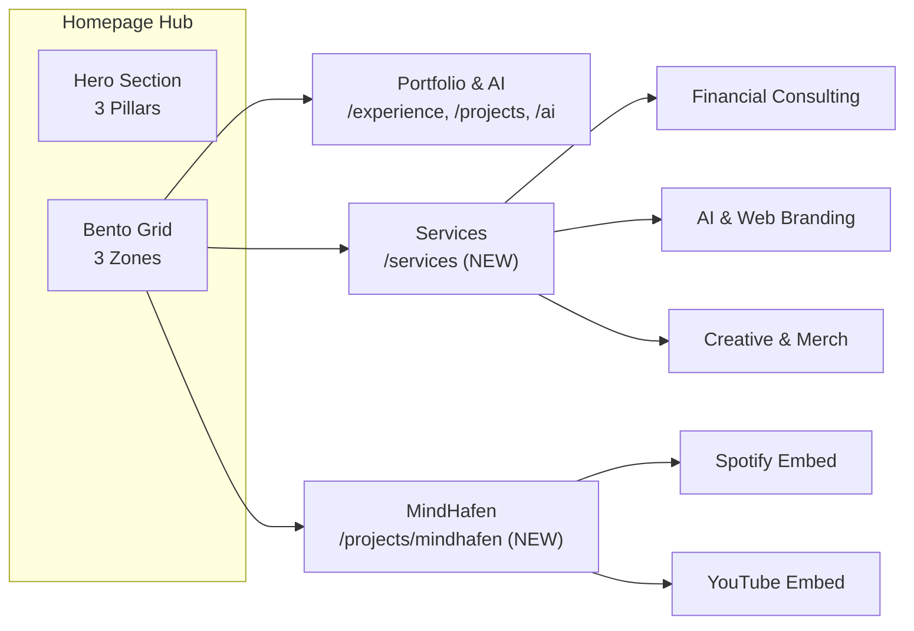
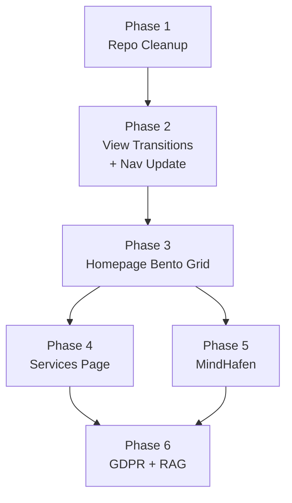

# Portfolio V2: "Hub" Architecture — Implementation Specification

> **Date**: 2026-02-14
> **Author**: Brainstorming (Gemini 3 × Mihai) + Technical specification (Antigravity)
> **Goal**: Transform me-mateescu.de from an interactive CV into a professional Hub with 3 pillars: **Tech/AI**, **Financial Services**, and **Creative Production (MindHafen)**.
> **Source**: [planificare.md](file:///home/mihai-82adrian/Projects/portfolio-astro/docs/planificare.md) — full brainstorming transcript

---

## Architecture Overview



---

## Phase 1: Repo Housekeeping

> **Effort**: ~15 min | **Risk**: None | **Dependencies**: None

### Problem

22 stale `.md` planning files and 10+ Lighthouse `.json` reports clutter the project root, distracting from source code.

### Actions

#### [NEW] `docs/archive/` directory

Move all legacy planning/audit files:

| Files to move | Target |
| --- | --- |
| `BLOG-ENHANCEMENT-PLAN.md`, `BLOG_IMAGE_PROMPTS.md`, `BLOG_PROJECTS_CONSOLIDATION.md` | `docs/archive/` |
| `CLOUDFLARE_ISSUES.md`, `COMPONENT-LIBRARY-REPORT.md`, `CONTENT-ACCURACY-PLAN.md` | `docs/archive/` |
| `DESIGN-SYSTEM.md`, `DESIGN-SYSTEM-IMPLEMENTATION.md`, `DESIGN-SYSTEM-COMPLETION-REPORT.md` | `docs/archive/` |
| `GISCUS_SETUP.md`, `IMPLEMENTATION_ROADMAP.md`, `NEXT_STEPS_PLAN.md` | `docs/archive/` |
| `LIGHTHOUSE_OPTIMIZATION.md`, `LIGHTHOUSE_REALITY_CHECK.md` | `docs/archive/` |
| `PERFORMANCE_AUDIT_RESULTS.md`, `PERFORMANCE_OPTIMIZATION_SUMMARY.md` | `docs/archive/` |
| `PHASE1-ISSUES-CHECKLIST.md`, `PHASE1-QUALITY-GATE-REPORT.md` | `docs/archive/` |
| `PROJECT-SETUP.md`, `SETUP-SUMMARY.md`, `TIER1_FEATURES_GAP_ANALYSIS.md` | `docs/archive/` |
| `audit-report.md`, `audit.log`, `dist-report.txt`, `PROJECT-TREE.txt` | `docs/archive/` |
| `PROJECTS-PAGE-IMPLEMENTATION-PLAN.md` | `docs/archive/` |

#### [DELETE] Lighthouse JSON reports from root

All `lighthouse-*.json`, `lighthouse-*.report.html`, `lighthouse-*.report.json`, `lighthouse-final`, `lighthouse-mobile-final`, `lighthouse-optimized` files — these are build artifacts, not source.

#### Post-cleanup root should contain only

`README.md`, `astro.config.mjs`, `tailwind.config.mjs`, `tsconfig.json`, `package.json`, `package-lock.json`, `netlify.toml`, `lighthouserc.json`, `.gitignore`

---

## Phase 2: Global UI & View Transitions

> **Effort**: ~30 min | **Risk**: Low | **Dependencies**: Phase 1

### 2A. View Transitions

#### [MODIFY] [BaseLayout.astro](file:///home/mihai-82adrian/Projects/portfolio-astro/src/layouts/BaseLayout.astro)

Add Astro's native View Transitions:

```diff
  // In frontmatter:
+ import { ViewTransitions } from 'astro:transitions';

  // In <head>:
+ <ViewTransitions />
```

This gives SPA-like page navigation with zero JS cost. Astro handles it natively.

### 2B. Navigation Update

#### [MODIFY] [Navigation.astro](file:///home/mihai-82adrian/Projects/portfolio-astro/src/components/layout/Navigation.astro)

Add "Services" link to `navigationLinks` array (line 21). **Services uses i18n-aware routing** (like About, Experience) because service descriptions must be localized for each market:

```diff
  const navigationLinks = [
    { href: `${basePath}/`, label: 'Home' },
    { href: `${basePath}/about`, label: 'About' },
    { href: `${basePath}/experience`, label: 'Experience' },
    { href: `/projects`, label: 'Projects' },
+   { href: `${basePath}/services`, label: 'Services' },
    { href: `/blog`, label: 'Blog' },
    { href: `/now`, label: 'Now' },
  ];
```

> Services uses `basePath`-aware routing → `/services` (DE), `/en/services` (EN), `/ro/services` (RO).

### Constraints

> [!CAUTION]
> **DO NOT** alter the existing "Ask Mihai · AI" chatbot UI, trigger button, floating widget, nudge tooltip, or loading animations. They are already optimized and tested live.

---

## Phase 3: Homepage Refactor (Bento Grid)

> **Effort**: ~2h | **Risk**: Medium (visual regression) | **Dependencies**: Phase 2

### 3A. Hero Section Update

#### [MODIFY] [index.astro](file:///home/mihai-82adrian/Projects/portfolio-astro/src/pages/index.astro) (+ EN/RO variants)

Update Hero props to reflect the 3 professional dimensions:

- **Finance Expert** (IHK-certified Finanzbuchhalter)
- **Tech/AI Developer** (Astro, Rust, Python, AI/ML)
- **Creative Producer** (MindHafen — music, merch, content)

Update `t.home.heroSkills` in [translations.ts](file:///home/mihai-82adrian/Projects/portfolio-astro/src/data/translations.ts) to include all 3 dimensions.

### 3B. Bento Grid Component

#### [NEW] `src/components/sections/BentoGrid.astro`

An asymmetric responsive grid (Tailwind CSS) with 3 interactive zones:

| Zone | Layout | Content | Link Target |
| --- | --- | --- | --- |
| **Portfolio & AI** | Large card (spans 2 cols on desktop) | Tech projects, AI chatbot showcase, experience | `/experience`, `/projects`, `/ai` |
| **Services** | Medium card | Financial consulting, web branding, creative services | `/services` |
| **MindHafen** | Medium card | Music, Spotify embed preview, YouTube placeholder | `/projects/mindhafen` |

Design rules:

- Use Eucalyptus design tokens (no magic numbers)
- Glassmorphism subtle background on hover
- Smooth hover scale + shadow transitions
- Icons/emoji for each zone
- Responsive: stacks vertically on mobile

### 3C. Homepage Integration

#### [MODIFY] [index.astro](file:///home/mihai-82adrian/Projects/portfolio-astro/src/pages/index.astro)

Insert `<BentoGrid />` between Hero and Contact sections. Current structure:

```
Hero → Contact → Quick Links (3 cards) → Skills → Leadership → Hobbies
```

New structure:

```
Hero (updated 3 pillars) → BentoGrid (NEW) → Contact → Skills → Leadership → Hobbies
```

The existing "Quick Links" (Education/Experience/Certifications cards) can be **kept as-is** below the BentoGrid — they still serve a useful purpose for recruiter-focused visitors.

---

## Phase 4: Services Page

> **Effort**: ~3h | **Risk**: Low | **Dependencies**: Phase 3

### 4A. Page Structure

#### [NEW] `src/pages/services.astro` (DE default)

#### [NEW] `src/pages/en/services.astro` (EN)

#### [NEW] `src/pages/ro/services.astro` (RO)

Three localized pages following the same pattern as `about.astro`, `experience.astro`, etc. All service descriptions, CTAs, and form labels are translated via `translations.ts`.

**Tier 1: Finanz- & Strategieberatung** (Financial & Strategy Consulting)

- Business plan creation
- Business analysis & recovery/development plans
- Bookkeeping services (IHK-certified: Fachkraft für Buchführung / Finanzbuchhalter)
- DATEV, USt, Finanzbuchhaltung expertise

**Tier 2: AI & Personal Branding Web**

- AI-powered portfolio websites (same tech stack as this site)
- LinkedIn & professional presence optimization
- "Your own AI chatbot" — powered by the proven Ask Mihai · AI platform

**Tier 3: Kreative Produktion** (Creative Production)

- Print-on-demand merchandise design (ProfitMinds experience)
- Custom audio instrumentals for online content
- Theme-based music production (focus/sleep/motivational)

> [!IMPORTANT]
> **No pricing displayed yet**. Pricing will be researched and calculated later using a dedicated deep research prompt.
> Each tier shows a brief description + a "Kontakt aufnehmen" (Get in touch) CTA button leading to the contact form.

### 4B. Contact Form

At the bottom of the services page, add a polished contact form with:

- Name field
- Email field
- Dropdown: *"Wie kann ich helfen?"* / *"How can I help?"*
  - Options: Finanzberatung / Web & AI / Kreative Produktion / Sonstiges
- Message textarea
- Submit button → `mailto:mihai.mateescu@web.de` (or a Cloudflare Worker endpoint for form handling, if desired later)

### 4C. Chat Widget Exclusion

#### [MODIFY] [BaseLayout.astro](file:///home/mihai-82adrian/Projects/portfolio-astro/src/layouts/BaseLayout.astro)

Conditionally render ChatDrawer based on page path:

```diff
  <!-- AI Chat Drawer (Global) -->
- <ChatDrawer />
+ {!Astro.url.pathname.startsWith('/services') && <ChatDrawer />}
```

This hides the AI chatbot on the Services page as requested.

---

## Phase 5: MindHafen Integration

> **Effort**: ~2h | **Risk**: Low | **Dependencies**: Phase 3

### 5A. Project Data

#### [MODIFY] [projects.json](file:///home/mihai-82adrian/Projects/portfolio-astro/src/data/projects.json)

Add a new category and project entry:

```json
{
  "categories": [
    { "id": "ai-research", "label": "AI Research", "icon": "🧠" },
    { "id": "ecommerce", "label": "E-commerce", "icon": "🛒" },
    { "id": "creative", "label": "Creative & Music", "icon": "🎵" }
  ]
}
```

New project entry for MindHafen:

```json
{
  "id": "mindhafen",
  "slug": "mindhafen",
  "title": "MindHafen",
  "tagline": "Human + AI Music Production & Digital Content",
  "description": "A creative platform combining human-crafted lyrics and musical structure with AI-powered production (Suno V5 Pro). Distributed via DistroKid across Spotify, YouTube, Instagram, and TikTok.",
  "category": "creative",
  "status": {
    "label": "Active",
    "indicator": "active",
    "progress": 100,
    "detail": "Publishing on all major platforms"
  },
  "featured": true,
  "techStack": [
    { "name": "Suno V5 Pro", "icon": "🎵", "category": "ai-tool" },
    { "name": "DistroKid", "icon": "📤", "category": "distribution" },
    { "name": "Stoic Philosophy", "icon": "🏛️", "category": "domain" }
  ],
  "links": {
    "spotify": "https://open.spotify.com/artist/YOUR_ID",
    "youtube": "https://youtube.com/@MindHafen",
    "instagram": "https://instagram.com/mindhafen",
    "tiktok": "https://tiktok.com/@mindhafen"
  }
}
```

> **Note**: Replace placeholder URLs with actual MindHafen links before deployment.

### 5B. Project Detail Page

#### [NEW] `src/pages/projects/mindhafen.astro`

A dedicated page with:

- **Narrative header**: The Human + AI Collaboration story
  - You create lyrics, musical structure, thematic direction (stoic-motivational)
  - AI (Suno V5 Pro) handles production
  - DistroKid handles distribution
- **Spotify Embed**: Native iframe mini-player showing latest tracks
- **YouTube Embed**: Playlist embed for Deep Focus / Deep Sleep playlists
- **Social links**: Instagram, TikTok, YouTube, Spotify badges
- **Content types callout**:
  - 🎧 Deep Focus/Work playlists (scientifically documented)
  - 🌙 Deep Sleep playlists
  - 💪 Stoic-motivational songs

### 5C. Visual Distinction

On the Projects index page, MindHafen's card should have:

- A distinct gradient background (e.g., subtle purple-to-eucalyptus) to differentiate from tech projects
- A `🎵 Featured` badge
- A mini Spotify player preview (if technically feasible with SSG)

---

## Phase 6: Compliance & RAG Updates

> **Effort**: ~2h | **Risk**: Medium (legal) | **Dependencies**: Phase 4-5

### 6A. GDPR Cookie Consent

#### [NEW] `src/components/CookieConsent.astro`

A minimal, Eucalyptus-themed banner at the bottom of the page:

- Shows on first visit (checks for `cookie_consent` in localStorage)
- Blocks non-essential cookies (`chat_session` quota cookie, analytics) until consent is given
- Options: "Akzeptieren" (Accept) / "Nur notwendige" (Essential only)
- Links to `/datenschutz` (Datenschutz page)

#### [MODIFY] [BaseLayout.astro](file:///home/mihai-82adrian/Projects/portfolio-astro/src/layouts/BaseLayout.astro)

Add `<CookieConsent />` before closing `</body>`.

### 6B. Corpus Updates

#### [MODIFY] [corpus.jsonl](file:///home/mihai-82adrian/Projects/portfolio-astro/public/corpus.jsonl)

Add new entries so the AI chatbot can discuss:

| Content Type | Entries | Languages |
| --- | --- | --- |
| `service` | 3 (financial, web, creative) | DE, EN, RO (9 total) |
| `project` (MindHafen) | 1 (detailed) | DE, EN, RO (3 total) |
| `faq` (new services) | 3-5 new questions | DE, EN, RO (9-15 total) |

---

## Implementation Order & Dependencies



> Phases 4 and 5 can be done in parallel after Phase 3.

---

## Verification Plan

### Automated

- `npm run build` — must compile all 60+ pages without errors
- `npm run lint:chat` — chat security checks pass
- `npm run check` — TypeScript type checking passes

### Manual

- Desktop + mobile responsive testing for Bento Grid
- View Transitions work across all page navigations
- Services page does NOT show the ChatDrawer
- MindHafen embeds (Spotify/YouTube) render correctly
- Cookie consent banner appears on first visit
- Dark mode works correctly on all new pages/components
